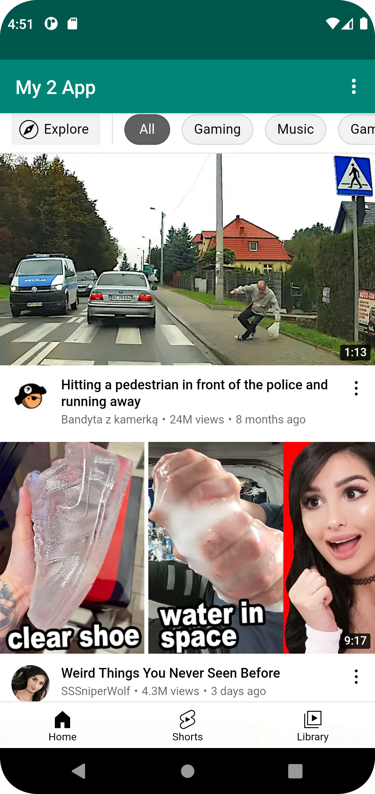

# Rapport

**
since I can't change what is written in git I have only changed the rapport.
```
<resources>
    <string name="app_name">My 2 App</string>
    <string name="action_external_web">External Web Page</string>
    <string name="action_internal_web">Internal Web Page</string> 
</resources>

<uses-permission android:name="android.permission.INTERNET" />

```
This how i change the app name webview to my 2 app, also i have have added the interned asses in AndroidManifest.xml.


```
 <WebView
        android:id="@+id/myapp"
        android:layout_width="match_parent"
        android:layout_height="match_parent"

        tools:ignore="MissingConstraints"
        tools:layout_editor_absoluteX="-2dp"
        tools:layout_editor_absoluteY="0dp" />
```
the second thing that changed is conten_main.xml page  i added webView in the content main page with id as you see is myapp.

```
 myapp = findViewById(R.id.myapp);
            myapp.getSettings().setJavaScriptEnabled(true);
            myapp.setWebViewClient(new WebViewClient());
            myapp.loadUrl("https://www.his.se/");
```
the third I added i this code so that on external and internal page so it shows two different pages when I click OptionsItemSelected()

```
<include layout="@layout/content_main" />
```
the last thing i added a incluede element so that he webview is seen by this page activity_main

**


_Du kan ta bort all text som finns sedan tidigare_.

## Följande grundsyn gäller dugga-svar:

- Ett kortfattat svar är att föredra. Svar som är längre än en sida text (skärmdumpar och programkod exkluderat) är onödigt långt.
- Svaret skall ha minst en snutt programkod.
- Svaret skall inkludera en kort övergripande förklarande text som redogör för vad respektive snutt programkod gör eller som svarar på annan teorifråga.
- Svaret skall ha minst en skärmdump. Skärmdumpar skall illustrera exekvering av relevant programkod. Eventuell text i skärmdumpar måste vara läsbar.
- I de fall detta efterfrågas, dela upp delar av ditt svar i för- och nackdelar. Dina för- respektive nackdelar skall vara i form av punktlistor med kortare stycken (3-4 meningar).

Programkod ska se ut som exemplet nedan. Koden måste vara korrekt indenterad då den blir lättare att läsa vilket gör det lättare att hitta syntaktiska fel.

```
function errorCallback(error) {
    switch(error.code) {
        case error.PERMISSION_DENIED:
            // Geolocation API stöds inte, gör något
            break;
        case error.POSITION_UNAVAILABLE:
            // Misslyckat positionsanrop, gör något
            break;
        case error.UNKNOWN_ERROR:
            // Okänt fel, gör något
            break;
    }
}
```

Bilder läggs i samma mapp som markdown-filen.



Läs gärna:

- Boulos, M.N.K., Warren, J., Gong, J. & Yue, P. (2010) Web GIS in practice VIII: HTML5 and the canvas element for interactive online mapping. International journal of health geographics 9, 14. Shin, Y. &
- Wunsche, B.C. (2013) A smartphone-based golf simulation exercise game for supporting arthritis patients. 2013 28th International Conference of Image and Vision Computing New Zealand (IVCNZ), IEEE, pp. 459–464.
- Wohlin, C., Runeson, P., Höst, M., Ohlsson, M.C., Regnell, B., Wesslén, A. (2012) Experimentation in Software Engineering, Berlin, Heidelberg: Springer Berlin Heidelberg.
